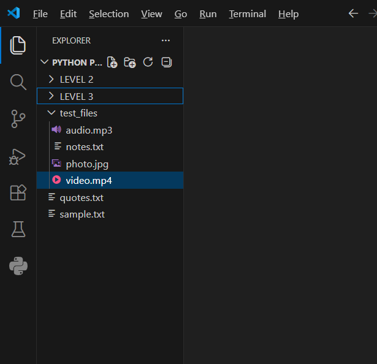
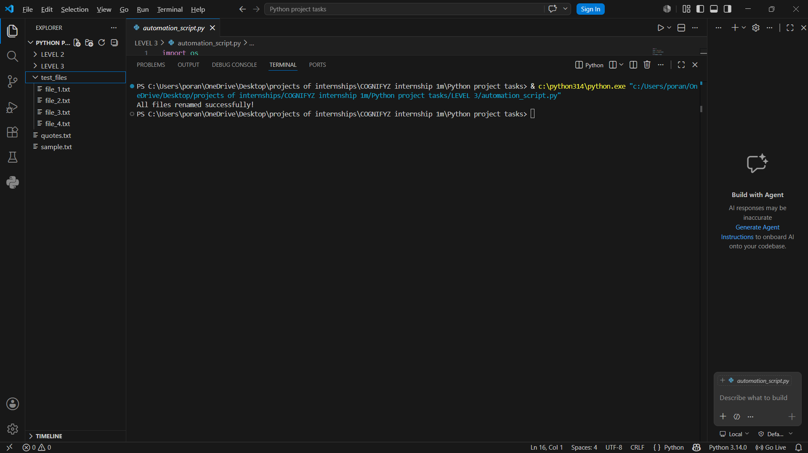

# Python Automation Script

## Overview
A Python automation script that automatically renames files inside a folder using Python's built-in OS module.

---

## Features
- Automates repetitive file renaming tasks
- Processes multiple files automatically
- Uses Python OS module for file handling
- Beginner-friendly automation project

---

## Technologies Used
- Python
- OS Module

---

## Project Workflow
1. Reads all files from a target folder
2. Skips Python files
3. Automatically renames files sequentially
4. Displays successful completion message

---

## Screenshots

### Before Automation


### After Automation


---

## Example Output

```bash
All files renamed successfully!
```
